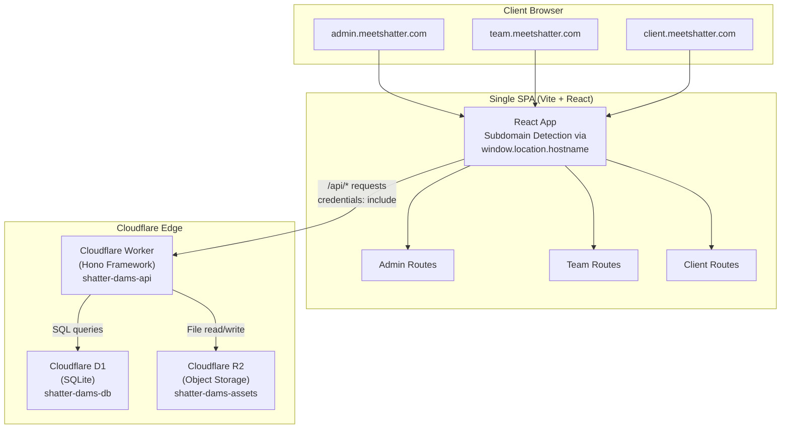
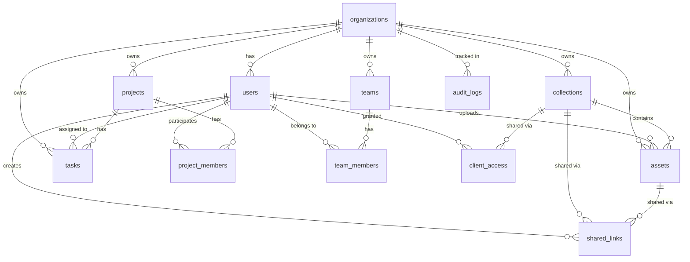
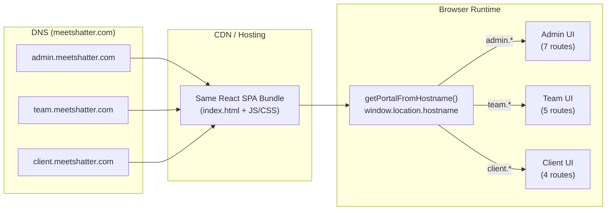
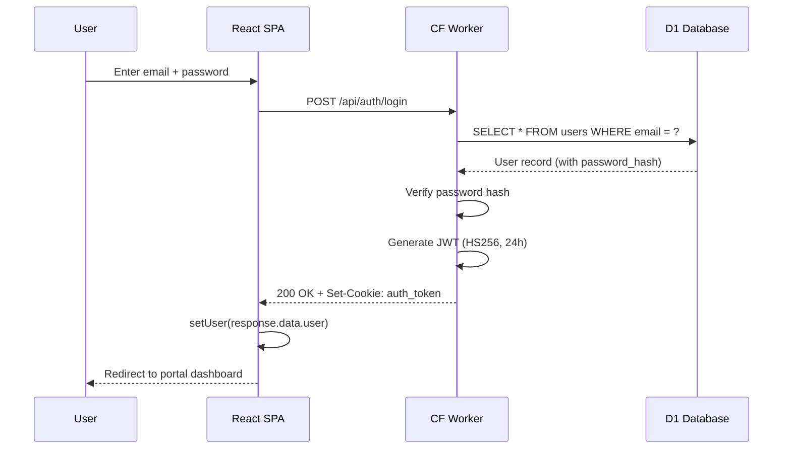
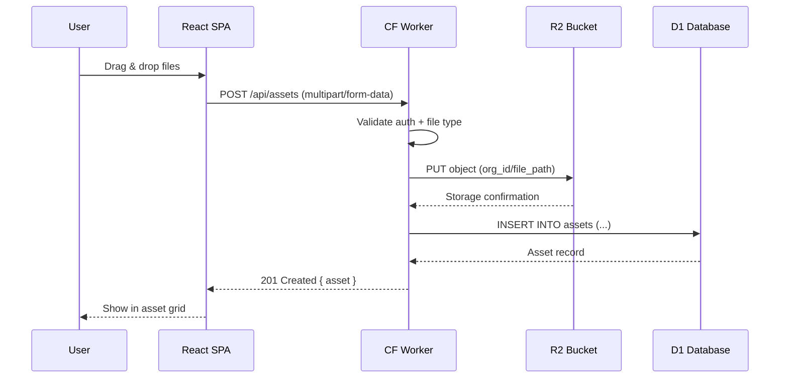
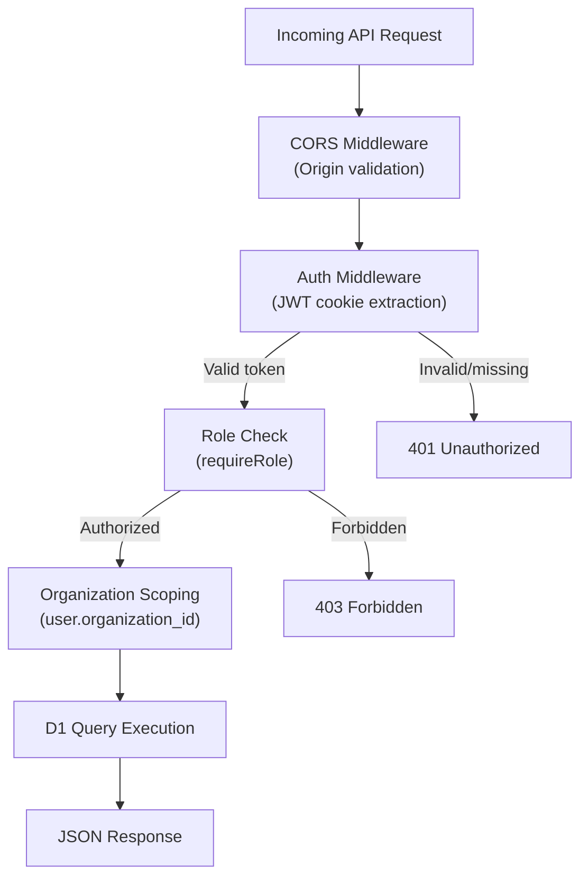

# Shatter DAMS — System Architecture Documentation

> **Last Updated**: July 5, 2026
> **Status**: Mock / Development Phase
> **Live Subdomains**: `admin.meetshatter.com` · `team.meetshatter.com` · `client.meetshatter.com`

---

## Table of Contents

- [1. System Overview](#1-system-overview)
- [2. High-Level Architecture](#2-high-level-architecture)
- [3. Technology Stack](#3-technology-stack)
- [4. Frontend — Vite + React SPA](#4-frontend--vite--react-spa)
- [5. Backend — Cloudflare Workers + Hono](#5-backend--cloudflare-workers--hono)
- [6. Database — Cloudflare D1](#6-database--cloudflare-d1)
- [7. File Storage — Cloudflare R2](#7-file-storage--cloudflare-r2)
- [8. Authentication & Authorization](#8-authentication--authorization)
- [9. Multi-Subdomain Architecture](#9-multi-subdomain-architecture)
- [10. API Reference](#10-api-reference)
- [11. Data Flow Diagrams](#11-data-flow-diagrams)
- [12. CORS & Security](#12-cors--security)
- [13. Development Environment](#13-development-environment)
- [14. Project History & Migration](#14-project-history--migration)
- [15. Current Limitations (Mock State)](#15-current-limitations-mock-state)
- [16. Directory Structure](#16-directory-structure)

---

## 1. System Overview

**Shatter DAMS** (Digital Asset Management System) is a multi-portal web application designed for organizations to manage, share, and collaborate on digital assets. The system serves three distinct user personas through three subdomains:

| Subdomain | Portal | Target Users | Purpose |
|---|---|---|---|
| `admin.meetshatter.com` | Admin Portal | System admins, superadmins | User management, team management, org settings, analytics, audit logs |
| `team.meetshatter.com` | Team Portal | Internal team members | Asset library, projects, task management, file uploads |
| `client.meetshatter.com` | Client Portal | External clients | View shared assets, browse collections, download files |

---

## 2. High-Level Architecture



**Architecture Pattern**: Decoupled SPA + API

- The **frontend** is a single React SPA deployed identically to all three subdomains. Subdomain detection happens at runtime in the browser.
- The **backend** is a Cloudflare Worker running the Hono web framework, exposing a REST API under `/api/*`.
- Communication between frontend and backend uses **JSON over HTTP** with **cookie-based JWT authentication**.

---

## 3. Technology Stack

### Frontend
| Layer | Technology | Version |
|---|---|---|
| Framework | React | 19.1.0 |
| Build Tool | Vite | 7.0.3 |
| Routing | react-router-dom | 7.6.3 |
| Styling | Tailwind CSS | 4.1.11 |
| Icons | lucide-react | 1.23.0 |
| Language | TypeScript | 5.8.3 |

### Backend
| Layer | Technology | Version |
|---|---|---|
| Runtime | Cloudflare Workers | — |
| Framework | Hono | 4.8.2 |
| Database | Cloudflare D1 (SQLite) | — |
| Object Storage | Cloudflare R2 | — |
| Language | TypeScript | 5.8.3 |
| Dev Tooling | Wrangler | 4.23.0 |

### Authentication
| Concern | Implementation |
|---|---|
| Token Format | JWT (HS256) |
| Signing | Web Crypto API (`crypto.subtle`) |
| Transport | HTTP-only cookie (`auth_token`) |
| Expiry | 24 hours |

---

## 4. Frontend — Vite + React SPA

### Entry Point

[main.tsx](file:///d:/Work/Shatter/WebProjects/Shatter%20DAMS/frontend/src/main.tsx) bootstraps the React app inside a `BrowserRouter` with the `AuthProvider` context wrapping all routes.

### Subdomain-Based Portal Selection

[App.tsx](file:///d:/Work/Shatter/WebProjects/Shatter%20DAMS/frontend/src/App.tsx) is the core router. It detects which portal to render by inspecting the browser's hostname:

```typescript
function getPortalFromHostname(): PortalType {
  const hostname = window.location.hostname;
  if (hostname.startsWith('admin')) return 'admin';
  if (hostname.startsWith('team'))  return 'team';
  if (hostname.startsWith('client')) return 'client';
  return 'team'; // default fallback
}
```

A single build artifact is deployed to all three subdomains. The same JavaScript bundle serves all portals — route rendering is conditional based on the detected portal type.

### Route Map

#### Admin Portal (`admin.meetshatter.com`)
| Path | Page Component | Description |
|---|---|---|
| `/` | `AdminDashboard` | Overview stats, recent activity, quick actions |
| `/users` | `UserManagement` | CRUD for users, role management, invite flow |
| `/teams` | `TeamManagement` | Team creation, member assignment |
| `/collections` | `Collections` | Organization-wide collection management |
| `/analytics` | `SystemAnalytics` | Usage charts and trends (mock data) |
| `/audit-log` | `AuditLog` | Filterable audit trail |
| `/settings` | `OrganizationSettings` | Org name, branding, defaults |

#### Team Portal (`team.meetshatter.com`)
| Path | Page Component | Description |
|---|---|---|
| `/` | `TeamDashboard` | Team stats, recent assets, project progress |
| `/assets` | `AssetLibrary` | Browse, search, filter all team assets |
| `/projects` | `Projects` | Project listing with status tracking |
| `/tasks` | `TaskBoard` | Kanban board (To Do → In Progress → Review → Done) |
| `/upload` | `Upload` | Multi-file upload with collection & tag selection |

#### Client Portal (`client.meetshatter.com`)
| Path | Page Component | Description |
|---|---|---|
| `/` | `ClientDashboard` | Overview of shared assets and recent activity |
| `/shared` | `SharedAssets` | Assets shared with the client |
| `/collections` | `ClientCollections` | Collections visible to the client |
| `/downloads` | `Downloads` | Download history |

#### Shared Routes (All Portals)
| Path | Page Component | Description |
|---|---|---|
| `/login` | `LoginPage` | Email/password login with animated background |

### Component Architecture

```
components/
├── animations/
│   └── AnimatedBackground.tsx      ← Login page gradient animation
├── common/                         ← Reusable UI primitives
│   ├── Badge.tsx                   ← Status badges with color variants
│   ├── Button.tsx                  ← Variants: primary/secondary/ghost/danger
│   ├── Card.tsx                    ← Card container with header/body
│   ├── Input.tsx                   ← Form input with label & error state
│   ├── LoadingSpinner.tsx          ← Animated spinner
│   ├── Modal.tsx                   ← Dialog with backdrop overlay
│   ├── Select.tsx                  ← Styled dropdown
│   ├── StatsCard.tsx               ← Metric display with icon & trend
│   └── Textarea.tsx                ← Styled textarea
├── layout/                         ← App shell components
│   ├── Header.tsx                  ← Top bar: search, notifications, user menu
│   ├── Layout.tsx                  ← Sidebar + main content (uses <Outlet />)
│   └── Sidebar.tsx                 ← Portal-specific navigation
└── shared/                         ← Domain-specific shared components
    ├── AssetGrid.tsx               ← Grid layout for asset thumbnails
    ├── AssetUpload.tsx             ← Drag-and-drop file upload
    ├── DataTable.tsx               ← Sortable data table
    └── FilterBar.tsx               ← Search & filter controls
```

### Navigation Configuration

[navigation.ts](file:///d:/Work/Shatter/WebProjects/Shatter%20DAMS/frontend/src/config/navigation.ts) defines per-portal sidebar navigation as a `Record<string, NavigationItem[]>`, keyed by portal type (`admin`, `team`, `client`). The `Sidebar` component reads this config based on the active portal.

### API Client

[api.ts](file:///d:/Work/Shatter/WebProjects/Shatter%20DAMS/frontend/src/services/api.ts) provides an `ApiClient` class wrapping `fetch` with:
- **Base URL**: Configured via `VITE_API_URL` env var (empty string in dev, since Vite proxies `/api` requests)
- **Credentials**: `credentials: 'include'` on all requests (sends cookies cross-origin)
- **Methods**: `get`, `post`, `put`, `delete`
- **Error handling**: Throws `ApiError` with status code and message

### State Management

- **Authentication state**: Managed via React Context ([AuthContext.tsx](file:///d:/Work/Shatter/WebProjects/Shatter%20DAMS/frontend/src/context/AuthContext.tsx))
- **API data fetching**: Custom [useApi](file:///d:/Work/Shatter/WebProjects/Shatter%20DAMS/frontend/src/hooks/useApi.ts) hook with auto-fetch, loading/error states, and refetch capability
- **No global state library** (e.g., Redux, Zustand) — component-level state + context only

### Type System

[types/index.ts](file:///d:/Work/Shatter/WebProjects/Shatter%20DAMS/frontend/src/types/index.ts) defines shared TypeScript interfaces:

| Type | Key Fields |
|---|---|
| `User` | id, email, name, role (`admin` / `team_member` / `client`), organization_id |
| `Asset` | id, name, file_type, file_size, url, thumbnail_url, tags, metadata |
| `Collection` | id, name, description, cover_image, asset_count, shared_with |
| `Project` | id, name, status, asset_count, team_members, deadline |
| `Task` | id, title, status, priority, assignee, project_id, due_date |
| `AuditLogEntry` | id, user_name, action, resource_type, details, ip_address |
| `Analytics` | total_assets, total_storage, total_users, total_downloads, trends |

### Design System

[theme.ts](file:///d:/Work/Shatter/WebProjects/Shatter%20DAMS/frontend/src/styles/theme.ts) defines design tokens:
- **Colors**: Brand palette (indigo-violet), surface colors (light/dark), status colors
- **Typography**: Inter font family as primary
- Custom Tailwind config with glassmorphism effects, neon shadows, and micro-animations (`fade-in`, `slide-up`, `float`, `gradient`, `shimmer`, `pulse-slow`, `bounce-subtle`)

---

## 5. Backend — Cloudflare Workers + Hono

### Entry Point

[index.ts](file:///d:/Work/Shatter/WebProjects/Shatter%20DAMS/backend/src/index.ts) creates a Hono app with global CORS middleware and mounts 9 route modules under `/api/`:

```typescript
app.use('*', corsMiddleware);

app.route('/api/auth',        authRoutes);
app.route('/api/users',       userRoutes);
app.route('/api/assets',      assetRoutes);
app.route('/api/collections', collectionRoutes);
app.route('/api/projects',    projectRoutes);
app.route('/api/tasks',       taskRoutes);
app.route('/api/teams',       teamRoutes);
app.route('/api/analytics',   analyticsRoutes);
app.route('/api/audit-log',   auditLogRoutes);

app.get('/api/health', (c) => c.json({ status: 'ok', timestamp: new Date().toISOString() }));
```

### Cloudflare Bindings

Defined in [wrangler.jsonc](file:///d:/Work/Shatter/WebProjects/Shatter%20DAMS/backend/wrangler.jsonc):

| Binding | Type | Name | Purpose |
|---|---|---|---|
| `DB` | D1 Database | `shatter-dams-db` | Primary relational data store (SQLite) |
| `ASSETS_BUCKET` | R2 Bucket | `shatter-dams-assets` | File/asset object storage |

### Environment Variables

Defined in [.dev.vars](file:///d:/Work/Shatter/WebProjects/Shatter%20DAMS/backend/.dev.vars) (dev) and Cloudflare dashboard (production):

| Variable | Dev Value | Purpose |
|---|---|---|
| `ENVIRONMENT` | `"development"` | Controls CORS permissiveness |
| `JWT_SECRET` | `"supersecret-dev-key-..."` | JWT signing key |
| `FRONTEND_URL` | `"http://localhost:5173"` | Frontend origin for redirects |

### Type Definitions

[types.ts](file:///d:/Work/Shatter/WebProjects/Shatter%20DAMS/backend/src/types.ts) defines the Hono app environment:

```typescript
type Bindings = {
  DB: D1Database;
  ASSETS_BUCKET: R2Bucket;
  JWT_SECRET: string;
  ENVIRONMENT: string;
  FRONTEND_URL: string;
};

type Variables = {
  user: { id, email, name, role, organization_id };
};
```

---

## 6. Database — Cloudflare D1

### Schema

The database consists of **12 tables** defined in the [initial migration](file:///d:/Work/Shatter/WebProjects/Shatter%20DAMS/backend/src/db/migrations/0001_initial.sql):



### Table Details

| Table | Primary Key | Key Columns | Relationships |
|---|---|---|---|
| `organizations` | `id` (hex UUID) | name, slug (unique), logo_url, settings (JSON) | Parent of most entities |
| `users` | `id` (hex UUID) | email (unique), name, password_hash, role, is_active | FK → organizations |
| `assets` | `id` (hex UUID) | name, original_filename, file_type, file_size, storage_path, tags (JSON), metadata (JSON), is_archived | FK → organizations, users, collections |
| `collections` | `id` (hex UUID) | name, description, is_public | FK → organizations, users |
| `projects` | `id` (hex UUID) | name, description, status, deadline | FK → organizations, users |
| `project_members` | `id` (hex UUID) | role | FK → projects, users |
| `tasks` | `id` (hex UUID) | title, description, status, priority, due_date | FK → projects, users (assignee + creator), organizations |
| `shared_links` | `id` (hex UUID) | token (unique), expires_at, password_hash, download_limit, download_count, is_active | FK → assets, collections, users |
| `client_access` | `id` (hex UUID) | permissions (`view`/`download`/`comment`) | FK → users (client + granter), collections |
| `audit_logs` | `id` (hex UUID) | action, resource_type, resource_id, details (JSON), ip_address, user_agent | FK → organizations, users |
| `teams` | `id` (hex UUID) | name, description | FK → organizations, users |
| `team_members` | `id` (hex UUID) | role (`lead`/`member`) | FK → teams, users |

### ID Generation

All primary keys use `lower(hex(randomblob(16)))` — 32-character lowercase hex strings generated by SQLite.

### Timestamps

All `created_at` and `updated_at` fields use `datetime('now')` (SQLite ISO-8601 text format).

### User Roles

```
superadmin → Full system access
admin      → Organization-level management
team_member → Asset management, projects, tasks
client     → View-only access to shared content
```

---

## 7. File Storage — Cloudflare R2

An R2 bucket named `shatter-dams-assets` is bound to the worker as `ASSETS_BUCKET`.

> [!WARNING]
> **Current State**: R2 integration is **configured but not fully implemented**. The asset upload route creates database records but does not yet write files to R2. This is part of the mock system.

**Intended usage**: Store uploaded digital assets (images, videos, documents, design files) with path-based organization under the organization's namespace.

---

## 8. Authentication & Authorization

### Authentication Flow

```mermaid
sequenceDiagram
    participant Browser
    participant SPA as React SPA
    participant API as Cloudflare Worker

    Browser->>SPA: Navigate to any portal
    SPA->>API: GET /api/auth/me (with cookie)
    
    alt Has valid JWT cookie
        API->>SPA: 200 { user: {...} }
        SPA->>Browser: Render portal
    else No cookie or expired
        API->>SPA: 401 Unauthorized
        SPA->>Browser: Redirect to /login
    end

    Browser->>SPA: Submit login form
    SPA->>API: POST /api/auth/login { email, password }
    API->>API: Validate credentials
    API->>API: Create JWT (HS256, 24h expiry)
    API->>SPA: 200 + Set-Cookie: auth_token=<jwt>; HttpOnly; SameSite=None; Secure
    SPA->>Browser: Redirect to portal dashboard
```

### JWT Implementation

[jwt.ts](file:///d:/Work/Shatter/WebProjects/Shatter%20DAMS/backend/src/utils/jwt.ts) implements JWT from scratch using the **Web Crypto API** (no external libraries):

- **Algorithm**: HMAC-SHA256 (`HS256`)
- **Signing**: `crypto.subtle.importKey` + `crypto.subtle.sign`
- **Verification**: `crypto.subtle.verify` + expiry check
- **Encoding**: Custom `base64url` implementation

### Cookie Configuration

```
Name:     auth_token
Value:    <JWT string>
HttpOnly: true          ← Not accessible via JavaScript
SameSite: None          ← Required for cross-origin cookies
Secure:   true          ← HTTPS only
Path:     /
```

### Authorization Middleware

[auth.ts](file:///d:/Work/Shatter/WebProjects/Shatter%20DAMS/backend/src/middleware/auth.ts) provides two middleware functions:

1. **`authMiddleware`** — Extracts JWT from cookie, verifies signature & expiry, sets `c.var.user`
2. **`requireRole(...roles)`** — Checks if authenticated user's role is in the allowed list

```typescript
// Usage in routes:
app.get('/api/users', authMiddleware, requireRole('admin', 'superadmin'), handler);
```

### Role-Based Access Control (RBAC)

| Route Group | Required Role(s) |
|---|---|
| `POST /api/auth/login` | Public |
| `POST /api/auth/logout` | Any authenticated |
| `GET /api/auth/me` | Any authenticated |
| `GET /api/users` | admin, superadmin |
| `POST /api/users` | admin, superadmin |
| `DELETE /api/users/:id` | admin, superadmin |
| `GET /api/audit-log` | admin, superadmin |
| All other CRUD routes | Any authenticated (org-scoped) |

---

## 9. Multi-Subdomain Architecture

### How It Works



### Key Design Decisions

1. **Single Build, Multiple Subdomains**: One SPA bundle is built and deployed. All three subdomains serve the exact same `index.html` and JS/CSS assets. Portal differentiation is purely client-side.

2. **No Server-Side Routing**: There is no server-side middleware or reverse proxy splitting traffic. The detection is a simple `hostname.startsWith()` check in React.

3. **Shared Components**: All portals share the same UI primitives (`Button`, `Card`, `DataTable`, etc.) and the same `Layout` shell — only the sidebar navigation items and rendered routes differ.

4. **Single API Backend**: All three portals talk to the **same** Cloudflare Worker API. Authorization is role-based, not subdomain-based — the API doesn't know or care which subdomain the request originated from.

5. **Default Fallback**: If the hostname doesn't match any known prefix, the app defaults to the **Team Portal**.

---

## 10. API Reference

### Base URL
- **Production**: `https://shatter-dams-api.<account>.workers.dev/api` (or custom domain)
- **Development**: `http://localhost:8787/api` (via Vite proxy at `http://localhost:5173`)

### Endpoints

#### Authentication (`/api/auth`)
| Method | Path | Auth | Description |
|---|---|---|---|
| `POST` | `/api/auth/login` | Public | Login with email/password, returns JWT cookie |
| `POST` | `/api/auth/logout` | Authenticated | Clears JWT cookie |
| `GET` | `/api/auth/me` | Authenticated | Returns current user profile |

#### Users (`/api/users`)
| Method | Path | Auth | Description |
|---|---|---|---|
| `GET` | `/api/users` | Admin | List all users in organization |
| `POST` | `/api/users` | Admin | Create a new user |
| `GET` | `/api/users/:id` | Authenticated | Get user by ID |
| `PUT` | `/api/users/:id` | Authenticated | Update user |
| `DELETE` | `/api/users/:id` | Admin | Delete user |

#### Assets (`/api/assets`)
| Method | Path | Auth | Description |
|---|---|---|---|
| `GET` | `/api/assets` | Authenticated | List assets (optional `?collection_id=`) |
| `POST` | `/api/assets` | Authenticated | Upload/create asset (mock) |
| `GET` | `/api/assets/:id` | Authenticated | Get asset details |
| `PUT` | `/api/assets/:id` | Authenticated | Update asset metadata |
| `DELETE` | `/api/assets/:id` | Authenticated | Delete asset |

#### Collections (`/api/collections`)
| Method | Path | Auth | Description |
|---|---|---|---|
| `GET` | `/api/collections` | Authenticated | List collections |
| `POST` | `/api/collections` | Authenticated | Create collection |
| `GET` | `/api/collections/:id` | Authenticated | Get collection with asset count |
| `PUT` | `/api/collections/:id` | Authenticated | Update collection |
| `DELETE` | `/api/collections/:id` | Authenticated | Delete collection |

#### Projects (`/api/projects`)
| Method | Path | Auth | Description |
|---|---|---|---|
| `GET` | `/api/projects` | Authenticated | List projects |
| `POST` | `/api/projects` | Authenticated | Create project |
| `GET` | `/api/projects/:id` | Authenticated | Get project with member count |
| `PUT` | `/api/projects/:id` | Authenticated | Update project |
| `DELETE` | `/api/projects/:id` | Authenticated | Delete project |

#### Tasks (`/api/tasks`)
| Method | Path | Auth | Description |
|---|---|---|---|
| `GET` | `/api/tasks` | Authenticated | List tasks (`?project_id=`, `?status=`) |
| `POST` | `/api/tasks` | Authenticated | Create task |
| `GET` | `/api/tasks/:id` | Authenticated | Get task |
| `PUT` | `/api/tasks/:id` | Authenticated | Update task |
| `DELETE` | `/api/tasks/:id` | Authenticated | Delete task |

#### Teams (`/api/teams`)
| Method | Path | Auth | Description |
|---|---|---|---|
| `GET` | `/api/teams` | Authenticated | List teams |
| `POST` | `/api/teams` | Authenticated | Create team |
| `GET` | `/api/teams/:id` | Authenticated | Get team with members |
| `PUT` | `/api/teams/:id` | Authenticated | Update team |
| `DELETE` | `/api/teams/:id` | Authenticated | Delete team |
| `POST` | `/api/teams/:id/members` | Authenticated | Add member to team |
| `DELETE` | `/api/teams/:id/members/:userId` | Authenticated | Remove member |

#### Analytics (`/api/analytics`)
| Method | Path | Auth | Description |
|---|---|---|---|
| `GET` | `/api/analytics` | Authenticated | Get analytics data (currently mock) |

#### Audit Log (`/api/audit-log`)
| Method | Path | Auth | Description |
|---|---|---|---|
| `GET` | `/api/audit-log` | Admin | List audit logs (`?limit=`, `?offset=`) |

#### Health Check
| Method | Path | Auth | Description |
|---|---|---|---|
| `GET` | `/api/health` | Public | Returns `{ status: "ok", timestamp }` |

---

## 11. Data Flow Diagrams

### Login Flow


### Asset Upload Flow (Intended)


### Data Access Pattern


---

## 12. CORS & Security

### CORS Configuration

[cors.ts](file:///d:/Work/Shatter/WebProjects/Shatter%20DAMS/backend/src/middleware/cors.ts) uses Hono's built-in CORS middleware with dynamic origin validation:

| Environment | Behavior |
|---|---|
| **Development** | All origins allowed (returns request origin) |
| **Production** | Allowlist: `https://admin.meetshatter.com`, `https://team.meetshatter.com`, `https://client.meetshatter.com` |

```
Access-Control-Allow-Credentials: true
Access-Control-Allow-Methods: GET, POST, PUT, DELETE, PATCH, OPTIONS
Access-Control-Allow-Headers: Content-Type, Authorization
Access-Control-Max-Age: 86400 (24 hours)
```

### Security Features
- **HTTP-only cookies** — JWT not accessible via `document.cookie`
- **SameSite=None + Secure** — Required for cross-origin cookie sharing across subdomains
- **Organization scoping** — All data queries are filtered by the authenticated user's `organization_id`
- **Role-based middleware** — Admin routes are protected with `requireRole('admin', 'superadmin')`

---

## 13. Development Environment

### Running Locally

```bash
# Terminal 1: Backend (Cloudflare Workers local dev)
cd backend
npm run dev          # → wrangler dev → http://localhost:8787

# Terminal 2: Frontend (Vite dev server)
cd frontend
npm run dev          # → vite → http://localhost:5173
```

### Dev Proxy

[vite.config.ts](file:///d:/Work/Shatter/WebProjects/Shatter%20DAMS/frontend/vite.config.ts) proxies all `/api` requests from the Vite dev server to the Wrangler dev server:

```typescript
server: {
  proxy: {
    '/api': {
      target: 'http://localhost:8787',
      changeOrigin: true,
    },
  },
},
```

This means in development, the frontend at `localhost:5173` transparently forwards API calls to `localhost:8787`, avoiding CORS issues during local development.

### Database Seeding

```bash
cd backend
npm run db:seed      # → node --loader tsx src/db/seed.ts
```

The [seed.ts](file:///d:/Work/Shatter/WebProjects/Shatter%20DAMS/backend/src/db/seed.ts) script populates the D1 database with:
- A demo organization
- Admin, team member, and client users
- Sample collections, assets, projects, tasks
- Audit log entries

---

## 14. Project History & Migration

### Original Architecture (Monolithic Next.js)

The project was originally built as a **monolithic Next.js application** (preserved in [.backup/](file:///d:/Work/Shatter/WebProjects/Shatter%20DAMS/.backup)):

```
Previous Stack:
├── Next.js (App Router)      → Server-side rendering + API routes
├── NextAuth                  → Authentication (OAuth + credentials)
├── Drizzle ORM               → Database ORM
├── PostgreSQL (via Supabase)  → Relational database
├── Supabase Storage           → File storage
└── Middleware                 → Route protection
```

### Current Architecture (Decoupled)

The system was **decoupled** into separate frontend and backend services:

```
Current Stack:
├── Vite + React SPA           → Client-side rendering only
├── Cloudflare Workers + Hono  → Serverless API
├── Custom JWT                 → Authentication (no NextAuth)
├── Cloudflare D1 (SQLite)     → Relational database
├── Cloudflare R2              → File storage
└── CORS middleware            → Cross-origin protection
```

### Why The Migration?

| Concern | Next.js Monolith | Decoupled Architecture |
|---|---|---|
| Hosting | Single Vercel deployment | Frontend: any CDN / Backend: Cloudflare Edge |
| Scaling | Tied to Vercel pricing | Workers scale to 0, edge-distributed |
| Database | Supabase PostgreSQL (managed) | D1 SQLite (serverless, co-located) |
| Auth | NextAuth (complex, opinionated) | Custom JWT (simple, portable) |
| Frontend | SSR/SSG overhead | Pure SPA, instant client-side nav |
| Deploy | Single deployment artifact | Independent deploy cycles |

> [!NOTE]
> The root `package.json` still contains Next.js dependencies (`next`, `next-auth`, `@supabase/supabase-js`, `drizzle-orm`, etc.) from the original architecture. These are **no longer used** and could be cleaned up.

---

## 15. Current Limitations (Mock State)

> [!IMPORTANT]
> The system is currently in a **mock/development state**. The following features are not yet fully implemented:

| Feature | Status | Notes |
|---|---|---|
| **R2 File Uploads** | ⚠️ Stubbed | Asset creation writes to DB but does not upload files to R2 |
| **Analytics** | ⚠️ Hardcoded | `/api/analytics` returns static mock data, not real aggregations |
| **Password Hashing** | ⚠️ Simplified | Mock seed data uses direct hash comparison, not bcrypt |
| **Email Notifications** | ❌ Not implemented | `resend` package in root deps but no integration |
| **Shared Links** | ❌ Not implemented | DB table exists, no API routes |
| **Client Access Control** | ❌ Not implemented | DB table exists, no API routes |
| **File Thumbnails** | ❌ Not implemented | `thumbnail_path` in schema, no generation logic |
| **Search** | ❌ Not implemented | Filter bar UI exists, no backend search API |
| **Real-time Updates** | ❌ Not implemented | No WebSocket or SSE integration |
| **PDF Export** | ❌ Not implemented | `jspdf` in root deps but unused |

---

## 16. Directory Structure

```
Shatter DAMS/
├── .backup/                          ← Previous Next.js monolith (archived)
│   ├── app/                          ← Next.js App Router pages & API routes
│   ├── auth.ts, auth.config.ts       ← NextAuth configuration
│   ├── components/                   ← React components
│   ├── lib/db/schema.ts              ← Drizzle ORM schema
│   └── middleware.ts                 ← Next.js middleware
│
├── backend/                          ← Cloudflare Workers API
│   ├── src/
│   │   ├── index.ts                  ← Hono app entry point
│   │   ├── types.ts                  ← Bindings & variable types
│   │   ├── db/
│   │   │   ├── migrations/0001_initial.sql  ← D1 schema migration
│   │   │   ├── schema.ts            ← Table name constants
│   │   │   └── seed.ts              ← Mock data seeder
│   │   ├── middleware/
│   │   │   ├── auth.ts              ← JWT auth + role middleware
│   │   │   └── cors.ts              ← Dynamic CORS origin
│   │   ├── routes/
│   │   │   ├── auth.ts              ← Login / logout / me
│   │   │   ├── users.ts             ← User CRUD
│   │   │   ├── assets.ts            ← Asset CRUD (mock uploads)
│   │   │   ├── collections.ts       ← Collection CRUD
│   │   │   ├── projects.ts          ← Project CRUD
│   │   │   ├── tasks.ts             ← Task CRUD
│   │   │   ├── teams.ts             ← Team CRUD + members
│   │   │   ├── analytics.ts         ← Mock analytics
│   │   │   └── audit-log.ts         ← Audit log queries
│   │   └── utils/
│   │       └── jwt.ts               ← Custom JWT (Web Crypto API)
│   ├── wrangler.jsonc                ← Worker config (D1 + R2 bindings)
│   ├── wrangler.toml                 ← Alternative worker config
│   ├── .dev.vars                     ← Dev environment variables
│   └── package.json                  ← Hono, wrangler, @cloudflare/workers-types
│
├── frontend/                         ← Vite + React SPA
│   ├── src/
│   │   ├── main.tsx                  ← React entry point
│   │   ├── App.tsx                   ← Subdomain routing logic
│   │   ├── index.css                 ← Global styles
│   │   ├── components/
│   │   │   ├── animations/           ← AnimatedBackground
│   │   │   ├── common/               ← Button, Card, Modal, Input, etc.
│   │   │   ├── layout/               ← Header, Sidebar, Layout
│   │   │   └── shared/               ← AssetGrid, DataTable, FilterBar
│   │   ├── config/navigation.ts      ← Per-portal navigation config
│   │   ├── context/AuthContext.tsx    ← Auth state (React Context)
│   │   ├── hooks/useApi.ts           ← Data fetching hook
│   │   ├── pages/
│   │   │   ├── admin/                ← 7 admin pages
│   │   │   ├── auth/LoginPage.tsx    ← Login page
│   │   │   ├── client/               ← 4 client pages
│   │   │   └── team/                 ← 5 team pages
│   │   ├── services/api.ts           ← Fetch-based API client
│   │   ├── styles/theme.ts           ← Design tokens
│   │   └── types/index.ts            ← Shared TypeScript types
│   ├── vite.config.ts                ← Vite config with /api proxy
│   ├── tailwind.config.ts            ← Custom Tailwind theme
│   └── package.json                  ← React, react-router-dom, Vite, Tailwind
│
├── package.json                      ← Root (vestige — contains old Next.js deps)
├── tsconfig.json                     ← Root TypeScript config
└── README.md                         ← Default Next.js README
```

---

> [!TIP]
> **Quick Start**: Run `cd backend && npm run dev` in one terminal and `cd frontend && npm run dev` in another. The frontend at `localhost:5173` will proxy API calls to `localhost:8787`. Access the admin portal by visiting `admin.localhost:5173` (or configure local `/etc/hosts` entries for `admin.meetshatter.com`, etc.).
